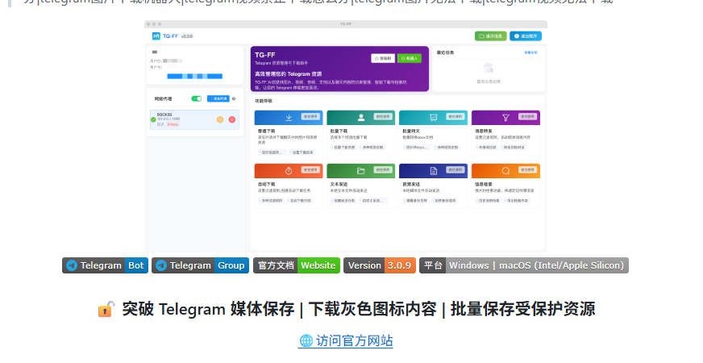

<h1 style="font-size: 4rem; margin: 0 0 0.35rem 0;">TeleBackup</h1>

<strong>Telegram 本地归档与智能克隆工具</strong> 基于 Flet 与 Telethon 的桌面应用，用于聊天记录归档、受保护媒体批量下载，以及频道 / 群组的智能镜像克隆。适合需要「TG 克隆」「电报备份」「频道搬家」等场景的用户（V1.2.1）。

<strong>V1.2.1 封面预览：突破 Telegram 媒体保存限制，支持电报备份与频道搬家。</strong>

<a href="https://chaotdex.cc" target="_blank" rel="noopener noreferrer">访问官方网站</a>

---

## 目录

- [它能解决什么](#它能解决什么)
- [主要功能](#主要功能)
- [智能镜像克隆](#智能镜像克隆-channel-clone)
- [本地归档与导出](#本地归档与导出)
- [其他实用能力](#其他实用能力)
- [适用人群](#适用人群)
- [使用提醒](#使用提醒)
- [系统要求](#系统要求)
- [版本信息](#版本信息)
- [技术支持](#技术支持)
- [常见问题（FAQ）](#常见问题faq)

---

## 它能解决什么

| 痛点 | 说明 |
|------|------|
| **图片 / 视频无法下载** | 灰色图标、受保护内容、提示「此内容无法保存」等 |
| **禁止保存媒体** | 在官方客户端受限时，仍支持批量保存图片、视频、文件 |
| **批量下载** | 大文件、断点续传、高并发，减少手工操作 |
| **禁止转发** | 通过克隆同步内容结构，而非简单逐条转发 |
| **整理困难** | 本地 SQLite（`messages.db`）存消息，便于搜索与导出 |
| **重复搬运** | 减轻手动复制，保持频道内容一致性 |

---

## 主要功能

- **图形界面**：Flet 现代桌面 UI，复杂操作无需命令行。
- **标签与收藏**：消息级标签、自定义收藏夹，快速定位关键内容。
- **高性能下载**：独立下载守护进程（`download_daemon`）与连接池，突破常见下载限制；断点续传与进度监控。
- **全类型媒体**：图片、视频、文档、压缩包等均可按规则保存到本地。
- **话题与评论**：支持论坛话题（Forum Topics）与评论区抓取与管理。
- **历史抓取**：可从最早消息起拉取，实现较完整的频道 / 群历史归档。
- **树状存储**：按频道、日期、类型等组织媒体目录，便于管理。
- **自定义重命名**：下载时按规则自动或手动命名。
- **本地搜索**：面向大量消息的检索，支持关键词与多条件组合。
- **磁盘监控**：实时查看存储占用，辅助管理备份空间。
- **增量备份**：只同步新增或变更，减轻重复劳动。
- **多账号**：多个 Telegram 账号统一在界面内管理。
- **去重与续传**：下载 / 上传侧智能去重与断点续传，大文件更稳。

---

## 智能镜像克隆（Channel Clone）

将源频道 / 群组的消息与媒体同步到目标对话。

- **`clone_rules_engine`**：克隆过程中可替换链接、按钮、文案、提及等，便于「干净」镜像。
- **`upload_daemon`**：分片上传、相册发送等，尽量保持内容结构完整。

适合备份重要频道、做内容镜像或跨对话整理。

---

## 本地归档与导出

- 消息存入 **SQLite**（`messages.db`），支持本地浏览与搜索。
- 可导出 **HTML**、**CSV** 等，便于离线查看或二次处理。
- 支持从 **Telegram Desktop `tdata`** 导入账号，简化多账号配置。

---

## 其他实用能力

- **Hash Breaker**（可选）：下载后调整文件哈希（一般**不改变**肉眼可见内容），用于规避部分平台基于哈希的重复判定；按需开启。
- **代理**：系统代理、自定义 SOCKS5 / HTTP 等，适配不同网络环境。

---

## 适用人群

需要 **批量保存 Telegram 媒体**、**频道归档**，或 **镜像同步** 的用户；个人整理与备份场景均可使用。

---

## 使用提醒

本工具仅用于 **合法、合规的个人备份与归档**。请遵守 **Telegram 服务条款**及当地法律法规。  
`data/` 目录包含会话与配置等 **敏感信息**，请妥善保管，勿随意泄露或删除正在使用的账号数据；建议定期备份该目录。

---

## 系统要求

- **Windows 10 / 11（64 位）**

---

## 版本信息

- **最新版本**：v1.2.1（详见更新日志）  
- **完整更新日志**：[chatdex.cc/zh/changelog](https://chatdex.cc/zh/changelog)

---

## 技术支持

| 渠道 | 链接 / 地址 |
|------|-------------|
| 官网 | [https://chatdex.cc](https://chatdex.cc) |
| Telegram | [t.me/telebackup_support](https://t.me/telebackup_support) |
| 邮件 | asd569.zk@gmail.com |

---

## 常见问题（FAQ）

**Q1：有免费版吗？**  
提供基础免费版（核心下载与基本归档）与专业版（高级克隆规则、Hash Breaker、更完整的多账号能力等）。

**Q2：会不会封号？**  
Telegram 对自动化有风控。建议控制任务频率（例如每周期上传任务不宜过高）、合理限速、避免长时间高频操作；工具侧有帮助降低异常的机制，但**无法保证零风险**，请谨慎自用。

**Q3：私密频道能克隆吗？**  
能，前提是当前账号已加入或有权访问；操作基于已登录会话。

**Q4：克隆有多快？**  
取决于网络、消息量、延时与是否上传媒体；文字与带媒体消息速度差异大。工具偏重稳定与安全，而非极限速度。

**Q5：需要一直开机吗？**  
克隆 / 下载 / 上传运行期间需要程序在线；支持断点续传与增量，重启后可从进度继续。

**Q6：能下「灰色 / 禁止保存」的媒体吗？**  
在多数场景下可通过协议路径拉取，具体仍受频道设置影响。

**Q7：克隆和转发有何不同？**  
克隆是结构化镜像（顺序、媒体、话题与评论等），并可配合规则引擎做文案 / 按钮替换；不是单条转发。

**Q8：磁盘占满怎么办？**  
大频道会占很多空间；可用树状目录、磁盘监控、去重、增量与自定义命名来管理。

**Q9：能搜历史消息吗？**  
可以，本地 SQLite + 内置搜索，支持多条件。

**Q10：能只克隆媒体或只克隆带媒体的消息吗？**  
可通过下载配置与克隆相关设置灵活选择。

**Q11：支持从 Telegram Desktop 的 tdata 导入吗？**  
支持。

**Q12：Hash Breaker 何时用？**  
在需要规避某些平台基于文件哈希的重复检测或限制时按需开启。

**Q13：支持话题与评论吗？**  
支持。

**Q14：多账号如何管理？**  
界面内统一管理；账号目录独立，代理等可全局共享以减少重复配置。

**Q15：导出格式与范围？**  
HTML（含媒体预览）、CSV 等；可按频道、时间范围或消息类型选择导出范围。

**Q16：支持代理吗？**  
支持；可在设置中配置系统或自定义代理。

**Q17：如何更新？**  
关注仓库动态或程序内更新提示，亦可访问 [chatdex.cc](https://chatdex.cc) 获取新版本。

**Q18：`data/` 能删吗？**  
包含 `app_config.json`、`download_config.json`、数据库与 session 等。**不要随意删除正在使用的账号目录**，以免丢数据或登录状态；重要数据请另做备份。

---

## 相关检索关键词

TG 克隆工具 · 电报消息克隆器 · TG 搬运工具 · 频道克隆软件 · Telegram 批量下载 · 内容备份 · 群组搬家 · 图片无法下载 · 视频无法下载 · 禁止下载 · 资源采集 · 受保护内容 · 频道搬运 

---

**欢迎搜索 TeleBackup 了解完整功能。** 若有具体场景或功能疑问，可通过上方渠道交流。
